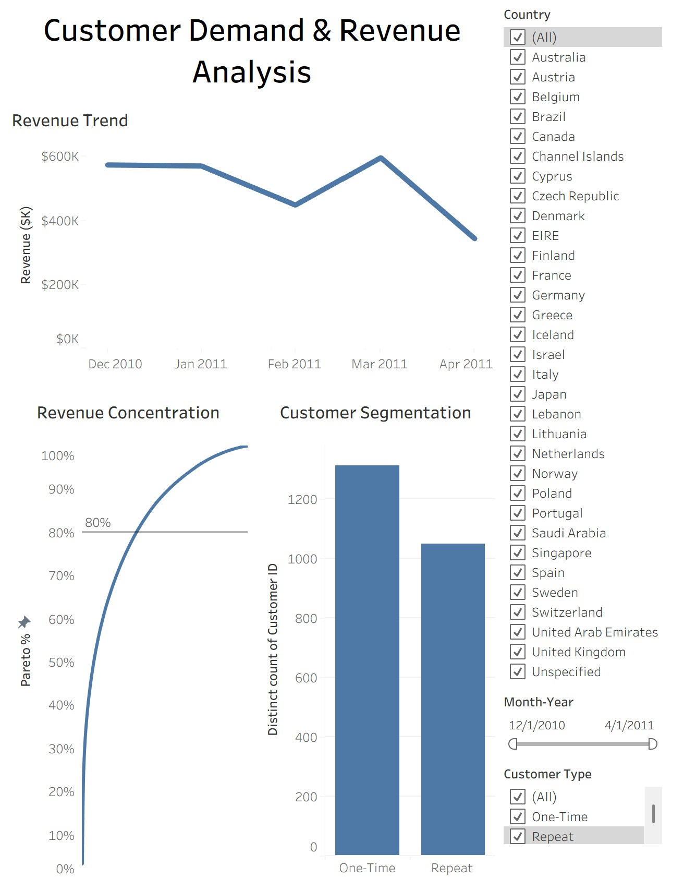
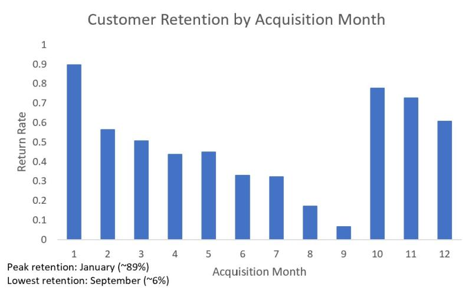

# 📊 Customer Demand Dynamics and Revenue Analysis (SQL + Tableau)

## Overview

This project analyzes transactional e-commerce data using SQL and Tableau to evaluate customer behavior, revenue concentration, and demand patterns. The goal is to move beyond basic aggregation and deliver a structured, business-oriented analysis with both analytical depth and visual clarity.

---

## 📊 Interactive Dashboard (Tableau)

An interactive Tableau dashboard was developed to visualize key insights and enable dynamic exploration of customer and revenue behavior.

The dashboard includes:

* Monthly revenue trend with proper time aggregation
* Customer segmentation (one-time vs repeat)
* Revenue concentration (Pareto analysis)
* Interactive filters for country, date, and customer type

🔗 **[View Interactive Dashboard](https://public.tableau.com/views/customer-demand-dashboard/Dashboard?:language=en-US&publish=yes&:sid=&:redirect=auth&:display_count=n&:origin=viz_share_link)**

---

## Executive Summary

Revenue is highly concentrated among a small subset of customers, creating potential fragility in the business model. While repeat purchasing is common, a significant share of customers transact only once, indicating continued reliance on customer acquisition.

Demand exhibits strong seasonality, with revenue peaking in the fall months and declining sharply after the holiday period. Peak activity occurs prior to December, reflecting advance purchasing behavior in e-commerce.

Customer value varies widely across the customer base, with no consistent relationship between purchase frequency and total spending. Cohort analysis further shows that retention differs significantly by acquisition timing.

---

## Key Questions

* Is revenue concentrated among a small group of customers?
* Does the business rely more on retention or acquisition?
* Is demand stable or seasonal?
* How does customer value vary across customers?
* Does customer retention differ based on acquisition timing?

---

## Data & Methodology

* **Dataset:** UCI Online Retail dataset
* **Tooling:** SQLite, Tableau

**Techniques Used:**

* Data cleaning using SQL views
* Aggregation and grouping
* Window functions for distribution analysis
* Time-based analysis
* Cohort-style retention analysis
* Data visualization and dashboarding in Tableau

---

## Analysis

### 🔹 Revenue Concentration

Revenue is heavily concentrated among top customers. A small percentage of customers account for a disproportionate share of total revenue, indicating a long-tail distribution and potential dependency on high-value customers. This pattern is visualized using a Pareto curve in Tableau.

---

### 🔹 Customer Retention

Approximately two-thirds of customers make repeat purchases, while one-third transact only once. This suggests moderate retention but continued reliance on customer acquisition.

---

### 🔹 Demand Trends

Revenue follows a clear seasonal pattern, increasing through the year and peaking in the fall months before declining sharply after the holiday period.

---

### 🔹 Customer Lifetime Value

Customer value varies significantly across the customer base. Some customers generate high revenue through frequent purchases, while others contribute large amounts through fewer transactions, indicating heterogeneous purchasing behavior.

---

### 🔹 Cohort-Based Retention

Retention varies by acquisition timing, with early-year and pre-holiday cohorts demonstrating stronger persistence than mid-year cohorts.

---

## Key Takeaways

* Revenue concentration introduces potential vulnerability to customer churn
* Retention exists but varies across customers
* Demand is highly seasonal
* Customer behavior is heterogeneous
* Customer value depends on both frequency and timing

---

## Limitations

* No customer demographic information available
* No product category or margin data
* Cannot distinguish between consumer and business customers
* Analysis is observational and does not imply causation

---

## How to Use this Project

1. Review the SQL queries in `customer_analysis.sql`
2. Explore the Tableau dashboard for interactive insights
3. Follow each section to understand how insights were generated

---

## Author's Note

This project demonstrates the ability to transform raw transactional data into actionable business insights using SQL and Tableau, combining data analysis with effective visual communication.
